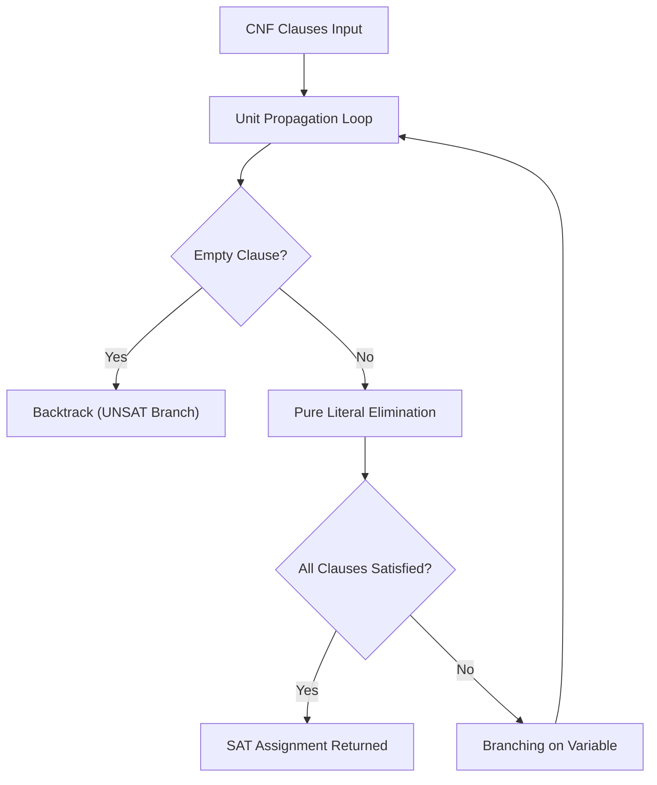

# DPLL SAT Solver Skill

Complete implementation of the Davis-Putnam-Logemann-Loveland (DPLL) Boolean satisfiability solver.

## Features
- **100% Python Standard Library**: Pure recursive backtracking engine.
- **Unit Propagation & Pure Literal**: Efficient clause reduction.
- **MCP Server Ready**: Direct stdio JSON-RPC 2.0 tool interface.
